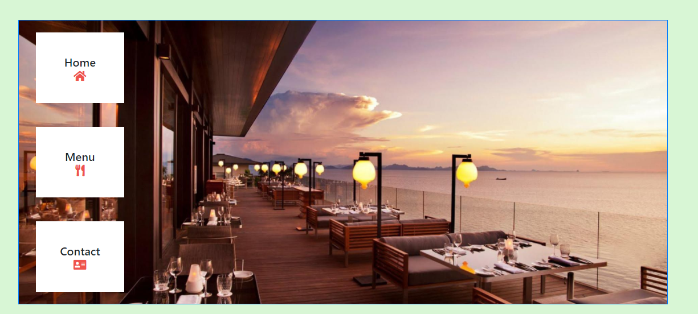
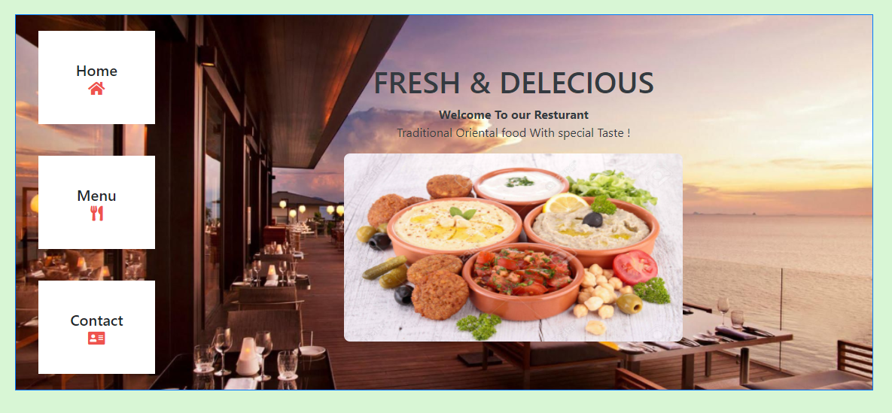

# Resturant App

>This is a web application for educational purposes. I created a simple resturant web with  very simple three pages. Each page has its button on the content container. By clicking each button, the simple page will appear at the same container.

 

## Example of Home page:



## Built With

- Javascript.
- HTML , CSS , Bootstrap.
- Webpack and CLI.

## Live Demo

[Live Demo Link](https://ahmedamin90.github.io/Resturant-page/)

## Getting Started

To get a local copy up and running follow these simple example steps.

### Setup

**STEP 1**
In the terminal, Run the following commands.

```bash
git clone https://github.com/AhmedAmin90/Resturant-page

cd Resturant-page
```

**STEP 2**
- Then open `dist` folder, then open `index.html` file using a browser.

## Authors

👤 **Ahmed Amin**

- GitHub: [@AhmedAmin90](https://github.com/AhmedAmin90)
- Twitter: [@AhmedAmin12383](https://twitter.com/AhmedAmin12383)
- LinkedIn: [Ahmed Amin](https://www.linkedin.com/in/web-developer/)


## 🤝 Contributing

Contributions, issues, and feature requests are welcome!

Feel free to check the [issues page]((https://github.com/AhmedAmin90/Resturant-page/issues)).

## Show your support

Give a ⭐️ if you like this project!

## License
<p>This project is <a href="./LICENSE">MIT</a> licensed.</p>